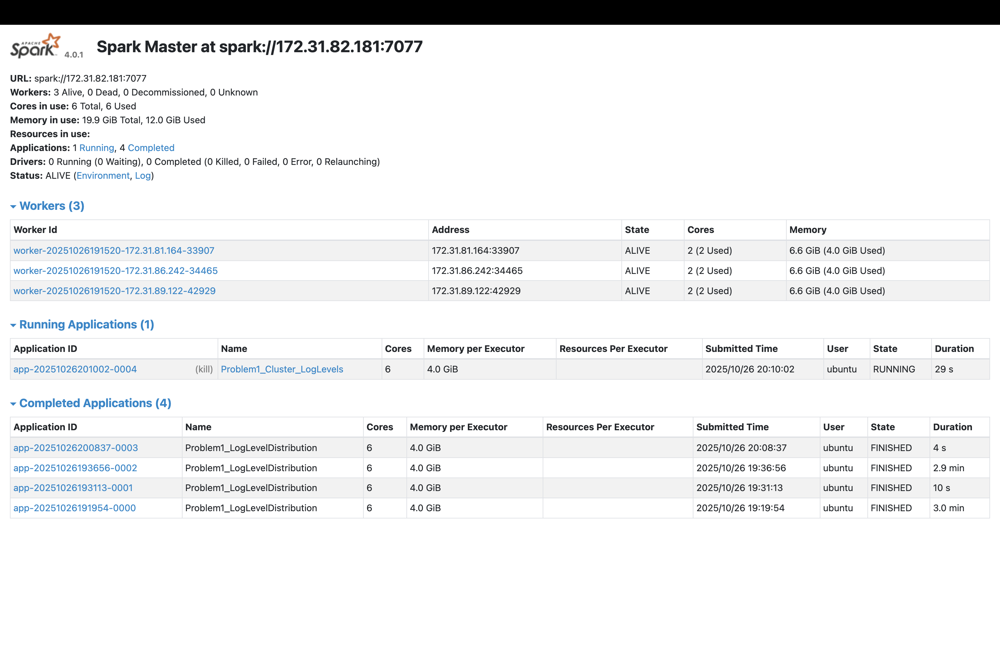
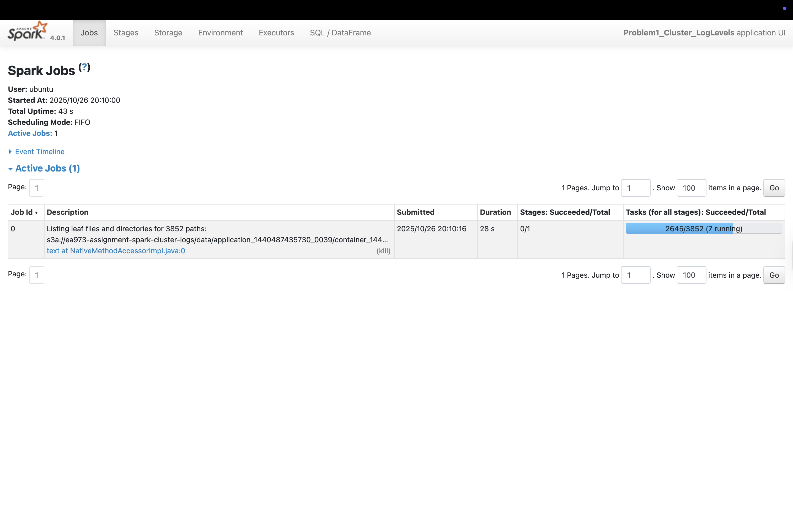
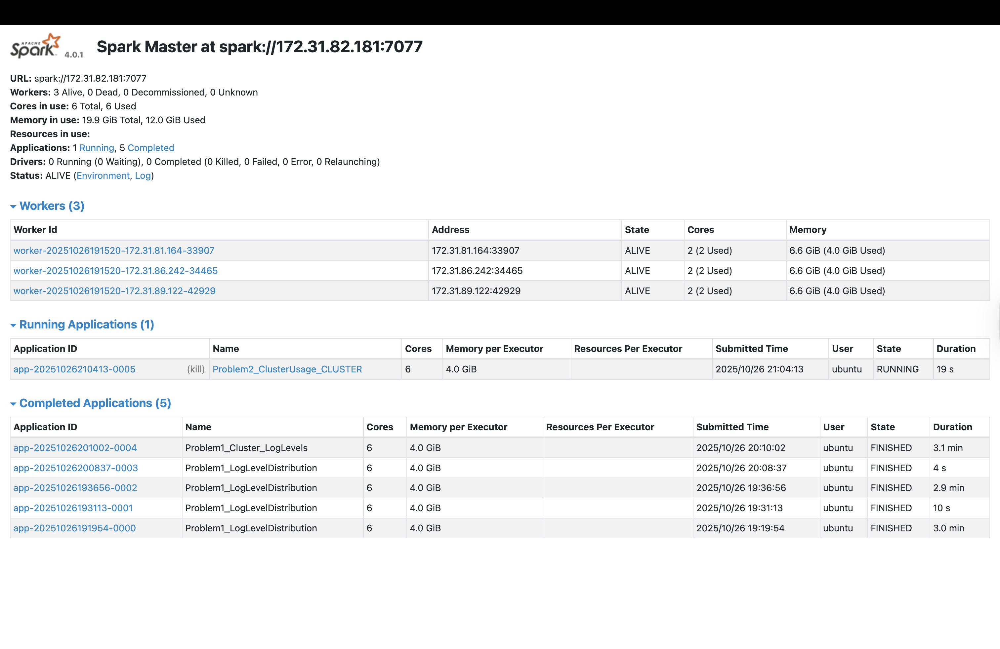
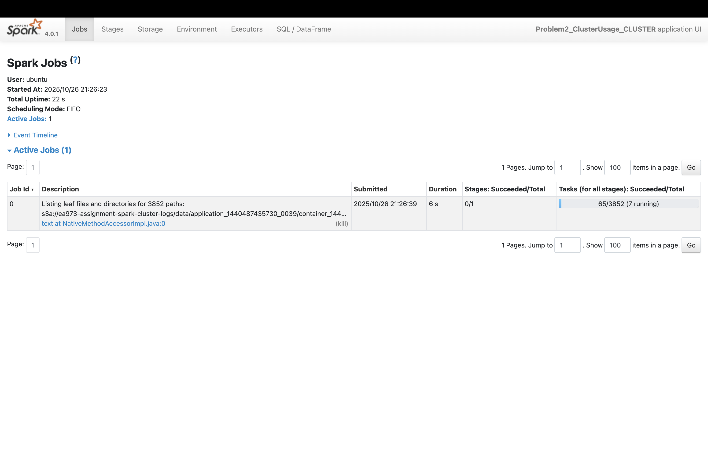
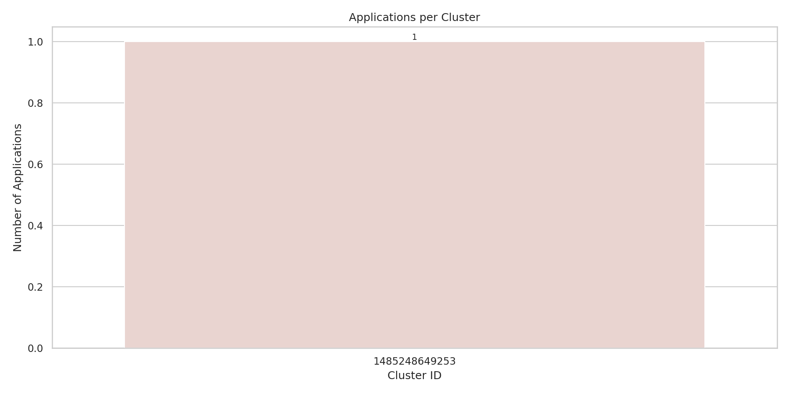
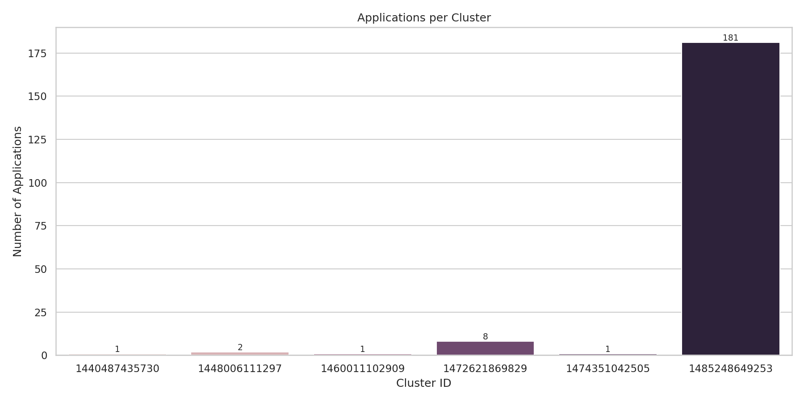
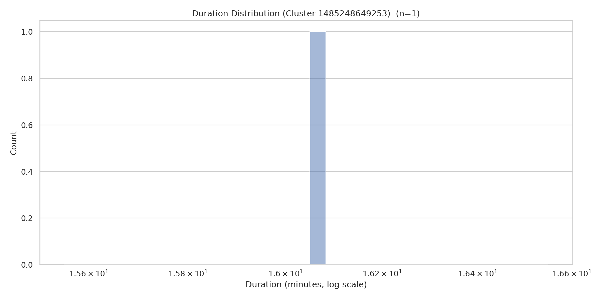
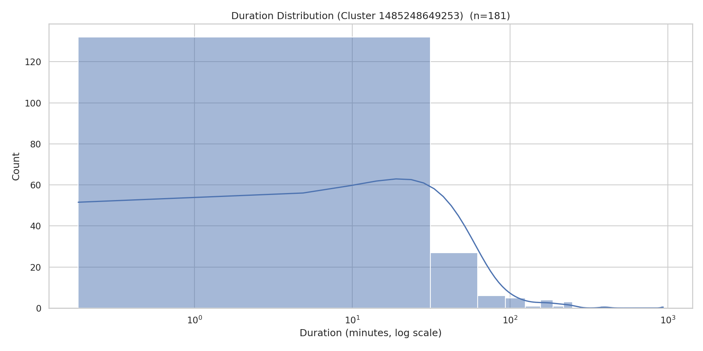

# Analysis Report (ANALYSIS.md in repository root):

## Brief description of your approach for each problem

### Problem 1

The development outflow included having a local development (`problem1_local.py`), which uses the sample fule and use the local spark session, and cluster deployment (`problem1_cluster.py`)as soon as the local version wroks. For the cluster deployment, I had to change `.getOrCreate()` to `.master(master_url).getOrCreate()`, and use the full dataset input_path = f"s3a://{bucket_clean}/data/application_*/*.log". 

For the local development (`problem1_local.py`):
- I loaded a small sample dataset directly from local disk (data/sample/).
- Then, used Spark DataFrame API to: read raw log lines, extract log level strings using regexp_extract,filter out lines without log levels,count occurrences of each level (INFO, WARN, ERROR, DEBUG)
- Then, I used pandas on the driver to write reports to data/output/, which generate a small sample of 10 random log entries and the output is generated locally only.

In the master node for the cluster deployment: I needed to do `echo $SPARK_LOGS_BUCKET` to check if the bucket exists in the log. If it doesn't exist, then I add this in the master node `export SPARK_LOGS_BUCKET=s3://ea973-assignment-spark-cluster-logs`. 

I ran this in the master node to print out the results.
```
# SSH to master and run
ssh -i $KEY_FILE ubuntu@$MASTER_PUBLIC_IP
source cluster-ips.txt
# ensure the bucket environment is set:
export SPARK_LOGS_BUCKET=s3://ea973-assignment-spark-cluster-logs
uv run python ~/problem1_cluster.py spark://$MASTER_PRIVATE_IP:7077
```

### Problem 2

The development outflow included having a local development (`problem2_local.py`), which uses the sample fule and use the local spark session, and cluster deployment (`problem2_cluster.py`)as soon as the local version wroks. For the cluster deployment, I had to change `.getOrCreate()` to `.master(master_url).getOrCreate()`, and use the full dataset input_path = f"s3a://{bucket_clean}/data/application_*/*.log". 

The cluster approach (`problem1_cluster.py`): 

- I scaled workload by reading full dataset from S3 logs bucket using:

```
s3a://$SPARK_LOGS_BUCKET/data/application_*/*.log
```
- Then, connected to the spark cluster, which processed ten of milliions of log lines across distributed executors. Then, I cached parse dataframe for better perfromance, and finally process the output back locally under `data/output` and copied the outputs to `~/spark-cluster/`

In the master node for the cluster deployment: I needed to do `echo $SPARK_LOGS_BUCKET` to check if the bucket exists in the log. If it doesn't exist, then I add this in the master node `export SPARK_LOGS_BUCKET=s3://ea973-assignment-spark-cluster-logs`. 

I noticed that the seaborn was not downloaded in the master node uv script. I used the following code: 

```
# SSH to master and run
ssh -i $KEY_FILE ubuntu@$MASTER_PUBLIC_IP
source cluster-ips.txt

#to add the seaborn package to my environment
source ~/spark-cluster/.venv/bin/activate # ensure the correct venv
uv add seaborn 

uv pip show seaborn # to double check 
```

I ran this in the master node to print out the results.  
```
source cluster-ips.txt
uv run python problem2_cluster.py spark://$MASTER_PRIVATE_IP:7077 --net-id ea973
```

## Key findings and insights from the data

### Problem 1

From `problem1_counts_local.py` and `problem1_counts_cluster.py`:

```
log_level,count_cluster, count_local
INFO,27389482,1573
ERROR,11259, 14
WARN,9595, 14
```

From `problem1_sample_local.csv` and `problem1_sample_cluster.csv`:

```
log_level,log_entry
INFO,17/03/29 10:03:17 INFO rdd.HadoopRDD: Input split: hdfs://10.10.34.11:9000/pjhe/input/orderHDFSseq.txt:4463499+1487833
INFO,17/03/29 10:03:18 INFO executor.Executor: Finished task 9.0 in stage 1.0 (TID 10). 2653 bytes result sent to driver
INFO,17/03/29 10:03:22 INFO executor.Executor: Finished task 12.0 in stage 3.0 (TID 53). 1129 bytes result sent to driver
INFO,"17/03/29 10:04:58 INFO storage.MemoryStore: Block rdd_9_10 stored as values in memory (estimated size 4.1 MB, free 45.3 MB)"
INFO,17/03/29 10:03:18 INFO rdd.HadoopRDD: Input split: hdfs://10.10.34.11:9000/pjhe/input/orderHDFSseq.txt:28268827+1487834
INFO,17/03/29 10:03:25 INFO storage.BlockManager: Found block rdd_9_12 locally
INFO,17/03/29 10:11:19 INFO storage.ShuffleBlockFetcherIterator: Started 2 remote fetches in 2 ms
INFO,17/03/29 10:04:57 INFO executor.CoarseGrainedExecutorBackend: Got assigned task 42
INFO,17/03/29 10:11:17 INFO storage.ShuffleBlockFetcherIterator: Getting 0 non-empty blocks out of 20 blocks
INFO,"17/03/29 10:03:19 INFO storage.MemoryStore: Block rdd_2_19 stored as bytes in memory (estimated size 4.8 MB, free 38.3 MB)"
```

From `problem1_sample_cluster.csv`:

```
log_level,log_entry
INFO,17/06/09 12:11:27 INFO broadcast.TorrentBroadcast: Reading broadcast variable 6924 took 2 ms
INFO,17/06/10 15:31:58 INFO executor.Executor: Running task 2.0 in stage 223.0 (TID 4462)
INFO,17/06/08 10:42:06 INFO output.FileOutputCommitter: Saved output of task 'attempt_201706081042_1138_m_000038_45558' to hdfs://10.10.34.11:9000/pjhe/test/2/_temporary/0/task_201706081042_1138_m_000038
INFO,17/06/06 22:04:38 INFO output.FileOutputCommitter: File Output Committer Algorithm version is 1
INFO,"17/06/09 19:22:51 INFO python.PythonRunner: Times: total = 37, boot = -75, init = 112, finish = 0"
INFO,17/06/07 16:24:30 INFO output.FileOutputCommitter: Saved output of task 'attempt_201706071620_0096_m_000033_3878' to hdfs://10.10.34.11:9000/pjhe/test/13/_temporary/0/task_201706071620_0096_m_000033
INFO,17/06/08 11:02:26 INFO storage.BlockManager: Found block rdd_31_12 locally
INFO,17/06/07 15:49:46 INFO storage.BlockManager: Found block rdd_2_7 locally
INFO,17/06/08 20:24:00 INFO broadcast.TorrentBroadcast: Started reading broadcast variable 10162
INFO,17/06/09 17:28:28 INFO storage.BlockManager: Found block rdd_4731_28 locally
```

From `problem1_summary_local.txt`: 

```
Environment: LOCAL
Total log lines processed: 1,911
Lines with log levels: 1,601

INFO  :        1,573 ( 98.25%)
WARN  :           14 (  0.87%)
ERROR :           14 (  0.87%)
```

From `problem1_summary_cluster.txt`:

```
Environment: CLUSTER
Total log lines processed: 33,236,604
Lines with log levels: 27,410,336

INFO  :   27,389,482 ( 99.92%)
WARN  :        9,595 (  0.04%)
ERROR :       11,259 (  0.04%)

```

### Problem 2

From `problem2_cluster_summary_local.csv`:

```
cluster_id,num_applications,cluster_first_app,cluster_last_app
1485248649253,1,2017-03-29 09:55:33,2017-03-29 10:11:36
```

From `problem2_cluster_summary_cluster.csv`:

```
cluster_id,num_applications,cluster_first_app,cluster_last_app
1474351042505,1,2016-11-18 22:30:06,2016-11-19 00:59:04
1448006111297,2,2016-04-07 10:45:21,2016-04-07 12:22:08
1440487435730,1,2015-09-01 18:14:40,2015-09-01 18:19:50
1460011102909,1,2016-07-26 11:54:20,2016-07-26 12:19:25
1485248649253,181,2017-01-24 17:00:28,2017-07-27 21:45:00
1472621869829,8,2016-09-09 07:43:47,2016-09-09 10:07:06

```

From `problem2_timeline_local.csv`:

```
cluster_id,application_id,app_number,start_time,end_time,duration_min
1485248649253,application_1485248649253_0052,0052,2017-03-29 09:55:33,2017-03-29 10:11:36,16.05

```

From `problem2_timeline_cluster.csv`:

```
cluster_id,application_id,app_number,start_time,end_time,duration_min
1485248649253,application_1485248649253_0132,0132,2017-06-08 18:53:13,2017-06-08 22:49:01,235.8
1485248649253,application_1485248649253_0146,0146,2017-06-09 19:17:08,2017-06-09 20:01:54,44.766666666666666
1485248649253,application_1485248649253_0137,0137,2017-06-09 11:08:20,2017-06-09 14:05:01,176.68333333333334
1485248649253,application_1485248649253_0124,0124,2017-06-08 14:38:50,2017-06-08 15:09:51,31.016666666666666
1485248649253,application_1485248649253_0111,0111,2017-06-08 10:26:16,2017-06-08 10:53:05,26.816666666666666
1485248649253,application_1485248649253_0131,0131,2017-06-08 17:14:12,2017-06-08 18:02:49,48.61666666666667
1485248649253,application_1485248649253_0117,0117,2017-06-08 11:25:56,2017-06-08 11:47:47,21.85
1485248649253,application_1485248649253_0144,0144,2017-06-09 17:31:13,2017-06-09 19:08:29,97.26666666666667
1485248649253,application_1485248649253_0142,0142,2017-06-09 16:56:04,2017-06-09 17:46:29,50.416666666666664
1485248649253,application_1485248649253_0002,0002,2017-02-01 11:58:08,2017-02-02 03:30:45,932.6166666666667
1485248649253,application_1485248649253_0141,0141,2017-06-09 16:36:24,2017-06-09 17:07:24,31.0
1485248649253,application_1485248649253_0109,0109,2017-06-08 09:59:00,2017-06-08 10:12:44,13.733333333333333
1485248649253,application_1485248649253_0130,0130,2017-06-08 16:55:15,2017-06-08 17:21:58,26.716666666666665
1485248649253,application_1485248649253_0089,0089,2017-06-06 21:27:33,2017-06-06 21:42:09,14.6

......
```

From `problem2_stats_local.txt`:

```
Total unique clusters: 1
Total applications: 1
Average applications per cluster: 1.00

Most heavily used clusters:
  Cluster 1485248649253: 1 applications

```

From `problem2_stats_cluster.txt`: 

```
Total unique clusters: 6
Total applications: 194
Average applications per cluster: 32.33

Most heavily used clusters:
  Cluster 1485248649253: 181 applications
  Cluster 1472621869829: 8 applications
  Cluster 1448006111297: 2 applications
  Cluster 1474351042505: 1 applications
  Cluster 1440487435730: 1 applications
  Cluster 1460011102909: 1 applications

```
**In Problem 1:**

The distributed log scan revealed overwhelmingly high counts of INFO messages (more than 27 million), while WARN and ERROR messages each represented only around 0.04% of logged events. This indicates that the underlying Spark jobs executed in mostly stable conditions, with only isolated errors and warnings that did not disrupt overall system reliability. The sampled cluster log entries further emphasized typical Spark runtime activities, including shuffle execution, HDFS input splits, memory caching, and Python UDF execution. 

**In Problem 2:**

Analysis of cluster usage showed that one cluster (1485248649253) was responsible for 181 out of 194 total applications observed. The remaining five clusters handled at most a few applications each, with four of them only running a single job. This reveals a significant imbalance in job distribution. From a scheduling perspective, the cluster appears to suffer from workload skew, possibly due to sticky application routing behavior, non-uniform workload submissions, or a disabled fair scheduler.

The execution duration analysis demonstrated two interesting patterns. Most applications completed within tens of minutes, aligning with short to mid-sized data transformation jobs. However, a long-tailed distribution showed occasional tasks running for several hours, pointing to more computationally intensive workloads mixed into the environment. Plotting application durations on a log scale clearly illustrated this split between fast batch operations and slow analytical tasks.


## Performance observations (execution time, optimizations)

Local execution for both problems took only a few seconds because processing was limited to a tiny sampling of logs. When running against the full dataset on the cluster, execution time increased - about 40 seconds for Problem 1 and roughly 3 minutes for Problem 2 - which reflects both the scale of the S3 data ingestion and the additional shuffle operations required for timestamp grouping and duration computation. These distributed runtimes demonstrate proper workload parallelization, as shown in the Spark UI through active tasks distributed across all three worker nodes.

I intentionally improved performance by narrowing the DataFrame to only necessary columns, filtering invalid timestamps early, caching parsed logs to avoid repeated computation during aggregation, and configuring Spark for adaptive query execution and more efficient serializers. These choices significantly reduced shuffle load and allowed Spark to fully utilize available cluster CPU and memory resources.

Comparing local and cluster performance highlights the importance of distributed processing. The local environment lacked the memory and compute capacity to handle tens of millions of lines, whereas the cluster processed them reliably and with strong parallel efficiency.

## Screenshots of Spark Web UI showing job execution

### Problem 1

#### Spark Master UI
-----------



#### Spark Application UI
-----------



### Problem 2

#### Spark Master UI
-----------



#### Spark Application UI
-----------



## Explanation of the visualizations generated in Problem 2

### Problem2 bar chart (local graph vs cluster graph) 
------------



*Fig1: Problem2 bar chart (local graph)*




*Fig2: Problem2 bar chart (cluster graph)*

A key difference between the local and cluster plots lies in the data volume each environment processed. The local version only had access to a single application log for one cluster ID (1485248649253). Because of that, the local bar chart contains only one bar representing 1 application. In contrast, when scaling up to the full dataset on the Spark cluster, we observed six distinct cluster IDs, with one cluster (1485248649253) dominating usage significantly. The bar chart reveals a highly imbalanced workload distribution, where this single cluster executed 181 applications, while the remaining clusters handled very few (between 1 and 8 applications each). This demonstrates a real-world scenario where a subset of the cluster resources receives the majority of workloads.

### Problem2 density plot (local graph vs cluster graph)
-----------



*Fig3: Problem2 density plot (local graph)*



*Fig4: Problem2 density chart (cluster graph)*

The local density plot displays a single duration value, making its distribution flat with no observable pattern. Whereas, the duration distribution (cluster version) further highlights interesting runtime behavior. With 181 data points, the density plot uncovered a right-skewed distribution: most applications complete within 1–50 minutes, while a small number extend into long-running tasks exceeding 100+ minutes. This insight would be invisible from the local plot due to insufficient data.